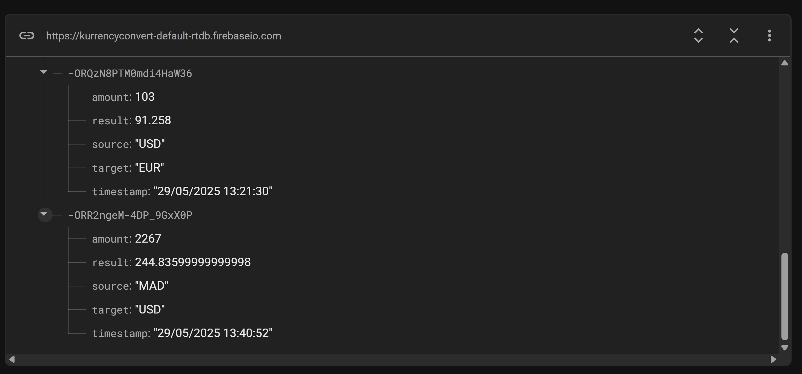

# KurrencyConvert - Application de Conversion de Devises

## Objectif du projet
KurrencyConvert est une application Android qui permet aux utilisateurs de convertir des montants entre différentes devises en utilisant une API de taux de change en temps réel. L'application sauvegarde également chaque conversion effectuée dans Firebase Realtime Database.

## Technologies utilisées
- **Langage de programmation** : Kotlin
- **Architecture** : MVVM (Model-View-ViewModel)
- **Interface utilisateur** : Jetpack Compose
- **Appels réseau** : Retrofit avec Kotlin Coroutines
- **Base de données en temps réel** : Firebase Realtime Database
- **Autres bibliothèques** : 
  - Lifecycle (ViewModel, LiveData)
  - OkHttp pour l'interception des requêtes
  - Gson pour la conversion JSON

## Fonctionnalités
- Sélection de devises source et cible via des menus déroulants
- Saisie d'un montant à convertir
- Conversion en temps réel via l'API exchangerate.host
- Affichage du résultat de la conversion
- Sauvegarde automatique des conversions dans Firebase

## Instructions pour exécuter l'application
1. Clonez le dépôt
2. Ouvrez le projet dans Android Studio
3. Assurez-vous que le fichier `google-services.json` est présent dans le dossier `app`
4. Exécutez l'application sur un émulateur ou un appareil physique

## Structure du projet
- **api** : Contient les interfaces et configurations pour les appels API
- **model** : Définit les modèles de données pour l'application
- **repository** : Gère l'accès aux données (API et Firebase)
- **viewmodel** : Contient la logique métier et fait le lien entre l'UI et les données
- **ui** : Contient les composants d'interface utilisateur

## Capture d'écran de Firebase Realtime Database

## Implémentation
L'application utilise l'architecture MVVM pour séparer la logique métier de l'interface utilisateur :
- **Model** : Représente les données et la logique métier
- **View** : Interface utilisateur construite avec Jetpack Compose
- **ViewModel** : Gère les états de l'UI et communique avec le repository

Les appels API sont effectués de manière asynchrone à l'aide de Kotlin Coroutines, ce qui permet une expérience utilisateur fluide sans bloquer le thread principal.

Chaque conversion est enregistrée dans Firebase Realtime Database avec les informations suivantes :
- Timestamp (date et heure de la conversion)
- Devise source
- Devise cible
- Montant saisi
- Résultat de la conversion
